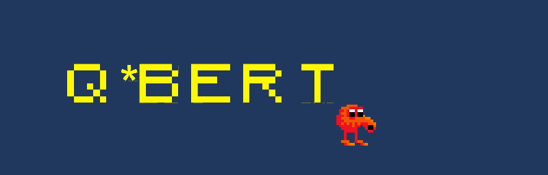
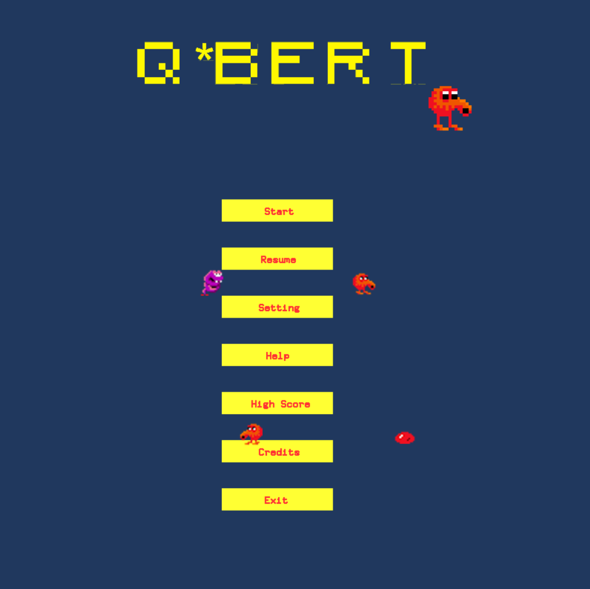
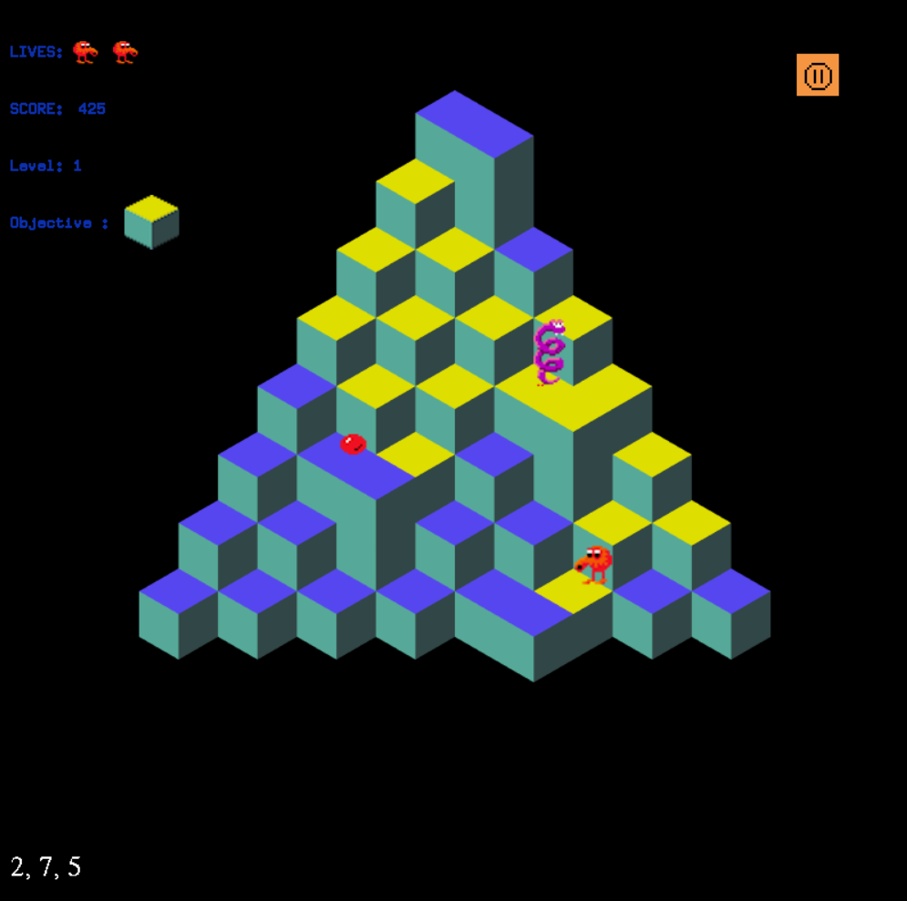
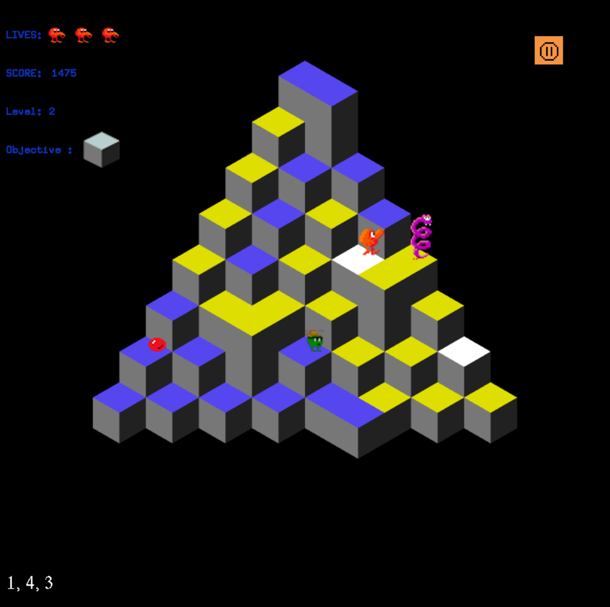
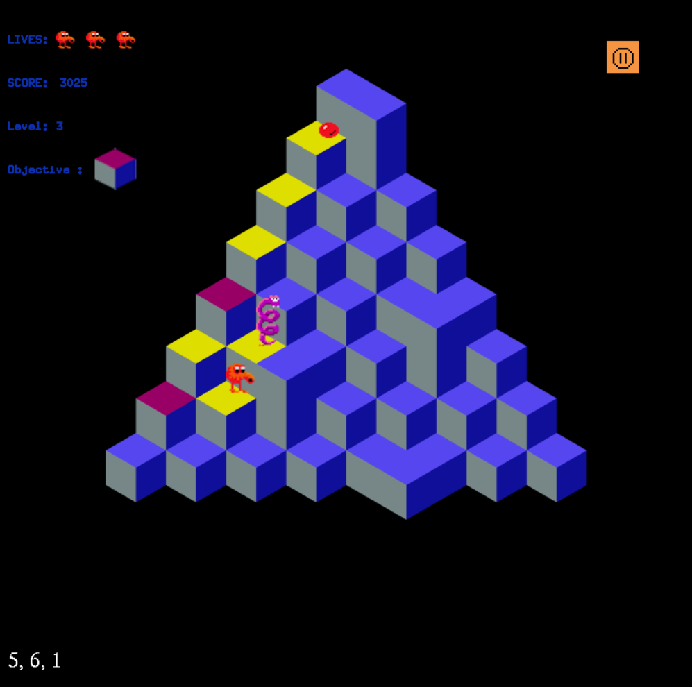
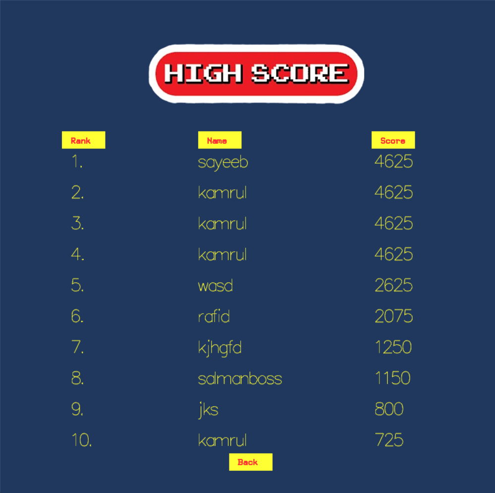
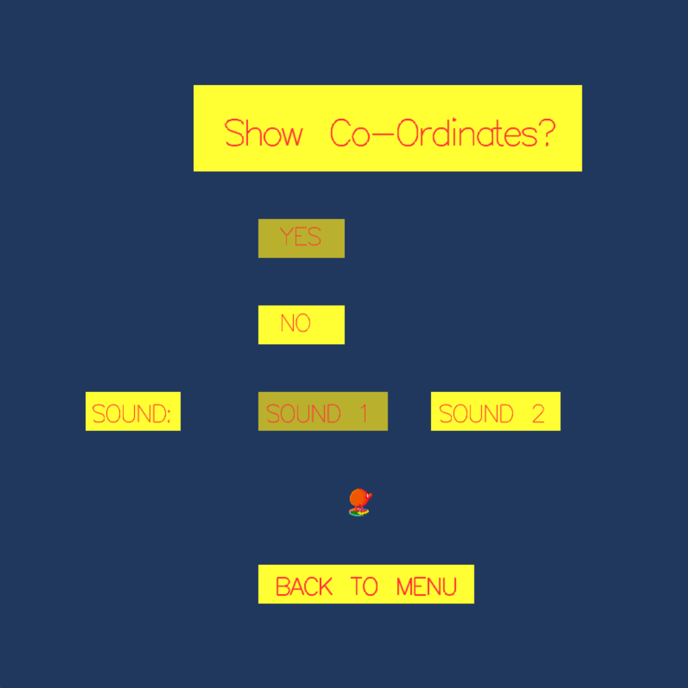
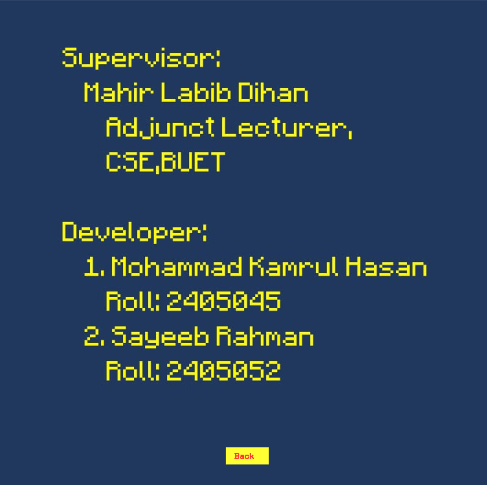

# Q\*bert Game Project

<div align="center">
  
  
  []()
  []()
  []()
</div>

## 🎮 About Q\*bert

Q\*bert is a classic arcade game reimplemented in C++ using OpenGL and GLUT. This project brings the nostalgic pyramid-hopping adventure to modern systems with enhanced graphics and smooth gameplay. Control the iconic orange character as he navigates a pyramid of cubes, changing their colors while avoiding enemies like Coily the snake, Ugg, Wrong-Way, and Sam.

### Key Features

- **Classic Gameplay**: Faithful recreation of the original Q\*bert mechanics
- **Multiple Levels**: Progressive difficulty with different pyramid configurations
- **Enemy AI**: Various enemy types with unique movement patterns
- **Sound Effects**: Immersive audio experience with background music and sound effects
- **High Score System**: Track your best performances
- **Smooth Animation**: Fluid character movements and transitions
- **Cross-Platform**: Runs on Windows and Linux systems

## 🎬 Gameplay Video

[](https://youtu.be/QrKFEBzO12I)

*Click the image above to watch our Q*bert gameplay demonstration

## 📸 Screenshots

### Main Menu & Navigation

<div align="center">
  
</div>

### Gameplay Levels

<div align="center">
  
  
  
</div>

### Game Features

<div align="center">
  
  
  <br/>
  
</div>

### Game Elements

- **Main Character**: Q\*bert navigating the pyramid
- **Enemies**: Coily (snake), Ugg, Wrong-Way, and Sam with unique behaviors
- **Power-ups**: Special items that help Q\*bert in his journey
- **Level Progression**: Multiple levels with increasing difficulty

## 🚀 Getting Started

### Prerequisites

- **Windows**: MinGW-w64 or Visual Studio with C++ support
- **Linux**: GCC with OpenGL development libraries
- **Dependencies**: OpenGL, GLUT, SDL2 (for audio)

### Installation

1. **Clone the repository**

   ```bash
   git clone https://github.com/Kamrulhasan12345/qbert-project.git
   cd qbert-project
   ```

2. **Windows Build**

   ```batch
   build.bat
   ```

3. **Linux Build**

   ```bash
   chmod +x build.sh
   ./build.sh
   ```

4. **Run the Game**

   ```batch
   # Windows
   runner.bat

   # Linux
   ./runner.sh
   ```

## 🎮 How to Play

### Controls

- **Arrow Keys**: Move Q\*bert around the pyramid

### Objective

- Change all cube colors on the pyramid by hopping on them
- Avoid enemies that chase Q\*bert
- Collect bonus points and power-ups
- Complete all levels to win the game

### Scoring System

- **Cube Color Change**: 25 points
- **Enemy Defeat**: 300-500 points
- **Level Completion**: Bonus points based on remaining lives
- **Perfect Level**: Additional bonus multiplier

## 🏗️ Project Structure

```
qbert/
├── iMain.cpp              # Main game logic and entry point
├── iGraphics.h            # Graphics engine and OpenGL wrapper
├── iSound.h               # Audio system implementation
├── assets/
│   ├── images/            # Game sprites and textures
│   └── sounds/            # Audio files and music
├── bin/                   # Compiled executables and DLLs
├── examples/              # Sample code and tutorials
├── demo/                  # Demo games and references
└── saves/                 # Save files and high scores
```

## 🛠️ Technical Details

### Technologies Used

- **Language**: C++ (C++11 standard)
- **Graphics**: OpenGL with GLUT
- **Audio**: SDL2_mixer for sound effects and music
- **Build System**: Custom build scripts (Batch/Shell)
- **Platform**: Cross-platform (Windows primary, Linux compatible)

### Key Components

- **Game Engine**: Custom 3D render engine
- **Physics**: Basic collision detection and movement
- **Animation**: Frame-based sprite animation system
- **State Management**: Menu, gameplay, and game over states
- **File I/O**: Save/load system for high scores and progress

## 👥 Team Information

### 🎓 Supervisor

**Mahir Labib Dihan**

- Department of Computer Science
- Bangladesh University of Engineering and Technology
- Email: mahirlabibdihan@gmail.com

### 👨‍💻 Development Team

**Mohammad Kamrul Hasan**

- **GitHub**: [@kamrulhasan12345](https://github.com/kamrulhasan12345)
- **Responsibilities**: Player - Enemy Logic, 3D Graphics Engine, Project Coordination

**Sayeeb Rahman**

- **GitHub**: [@sayeeb-does](https://github.com/syaeeb-does)
- **Responsibilities**: UI/UX, Game Logic, Highscores, Credits, Settings

Thanks a lot for reading till the end!
